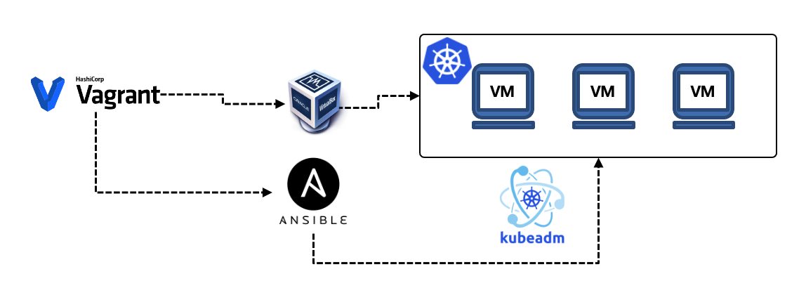

# Using Vagrant and Ansible to Create a Kubernetes Cluster(Using Kubeadm)

Vagrant를 사용하여 Virtualbox VM을 만들고 Ansible을 사용하여 Kubernetes 설치를 자동화함으로써 클러스터를 실행하는 방법을 설명 드립니다. 사전 준비 사항으로서 VirtualBox, Vagrant 및 Ansible을 로컬 머신에 사전에 설치하셔야 합니다.

## 사전 준비 사항
- VirtualBox
- Vagrant
- Ansible

## 01. Vagrant 사용하여 VirtualBox VM 생성

VM의 OS, VM 개수 및 Spec은 VagrantFile을 수정하여 생성합니다. 그리고 추가적으로 Vagrant는 VM 생성한 후 Ansible Playbook을 실행하여 Kubernetes(using Kubeadm)가 설치되도록 하였습니다. Kubeadm 설치시 필요한 정보공유를 위해서 로컬 Host와 디렉토리가 mount되도록 Vagrant를 설정했습니다.

~~~
IMAGE_NAME = "bento/ubuntu-18.04"
N = 2

Vagrant.configure("2") do |config|
    config.ssh.insert_key = false

    config.vm.provider "virtualbox" do |v|
        v.memory = 2048
        v.cpus = 1
    end
    config.vm.synced_folder "./", "/home/vagrant/sync", owner: "vagrant",
      group: "vagrant", mount_options: ["dmode=777", "fmode=777"]
      
    config.vm.box_check_update = false

    config.vm.define "k8s-master" do |master|
        master.vm.box = IMAGE_NAME

        master.vm.network "private_network", ip: "192.168.55.10"
        master.vm.hostname = "k8s-master"
        master.vm.provider :virtualbox do |v|
            v.customize ["modifyvm", :id, "--memory", 4096]
            v.customize ["modifyvm", :id, "--cpus", 4]
        end        
        master.vm.provision "ansible" do |ansible|
            ansible.playbook = "kubeadm-setup/master-playbook.yml"
            ansible.extra_vars = {
                node_ip: "192.168.55.10",
            }
        end
    end

    (1..N).each do |i|
        config.vm.define "node-#{i}" do |node|
            node.vm.box = IMAGE_NAME
            node.vm.network "private_network", ip: "192.168.55.#{i + 10}"
            node.vm.hostname = "node-#{i}"
            node.vm.provision "ansible" do |ansible|
                ansible.playbook = "kubeadm-setup/node-playbook.yml"
                ansible.extra_vars = {
                    node_ip: "192.168.55.#{i + 10}",
                }
            end
        end
    end
    
end

~~~

## 02. Ansible playbook 생성

각각 역할이 다르기 때문에 Master node에서 실행해야 할 Ansible Playbook과, Node에서 실행해야 할 Ansible Playbook를 생성합니다.

### 2-1 Master Node Playbook 생성

설치 해야 할 Ansible code는 아래와 같습니다.

- 패키지 설치 및 패킷처리를 위한 설치(all)
- 컨테이너 런타임 설치 Code(all)
- Kubernetes 패키지 설치(all)
- Master node 구성-Kubeadmi init(Master 노드)
- Node 구성-Kubeadm Join(각 Ndode)

#### 2-1-1. 패키지 설치 및 패킷처리를 위한 설정
~~~
   - name: 'Disable SWAP since kubernetes cant work with swap enabled '
      shell: |
        swapoff -a    
        modprobe overlay
        modprobe br_netfilter

    - name: Update and upgrade apt package
      apt:
        upgrade: yes
        update_cache: yes
        cache_valid_time: 86400 #One day

    - name: install extra packages
      apt:
        name: "{{ item }}"
        update_cache: yes
        state: present
      with_items:
        - 'apt-transport-https' 
        - 'ca-certificates' 
        - 'curl' 
        - 'software-properties-common'
        - 'gnupg2'

    - name: Disable iptables
      shell: |
        echo "net.bridge.bridge-nf-call-iptables=1" >> /etc/sysctl.conf
        echo "net.bridge.bridge-nf-call-ip6tables=1" >> /etc/sysctl.conf
        echo "net.ipv4.ip_forward=1" >> /etc/sysctl.conf
        sysctl --system          
~~~        
#### 2-1-2. 컨테이너 런타임 설치

여러가지 컨테이너 런타임이 있지만, 여기에서는 Docker를 설치하도록 하겠습니다.

~~~
    - name: Add Docker GPG key
      apt_key: 
        url: https://download.docker.com/linux/ubuntu/gpg
        state: present

    - name: create repo line
      command: bash -c "echo \"deb [arch=amd64] https://download.docker.com/linux/ubuntu $(lsb_release -cs) stable\" "
      register: docker_repo_line
   
    - debug: 
        msg: "{{ docker_repo_line.stdout }}"

    - name: add docker repo
      apt_repository:
        repo: "{{ docker_repo_line.stdout }}"
        state: present

    - name: Register distribution *short* code name
      shell: lsb_release -cs
      register: lsb_release

    - name: remove possible old versions
      apt:
        name: "{{ item }}"
        state: absent
      loop:
        - docker 
        - docker-engine 
        - docker.io

    - name: Install docker and dependecies
      apt: 
        name: "{{ packages }}"
        state: present
        force: True
        update_cache: yes
      vars:
        packages:
          - 'containerd.io=1.2.13-2' 
          - 'docker-ce=5:19.03.11~3-0~ubuntu-{{ lsb_release.stdout }}' 
          - 'docker-ce-cli=5:19.03.11~3-0~ubuntu-{{ lsb_release.stdout }}'

    - name: Restart docker
      systemd:
        name: docker
        daemon_reload: True
        state: restarted

    - name: Set native.cgroupdriver=systemd
      blockinfile:
        path: /etc/docker/daemon.json
        create: yes
        marker: ''
        block: |
         {
          "exec-opts": ["native.cgroupdriver=systemd"],
          "log-driver": "json-file",
          "log-opts": {
           "max-size": "100m"
           },
          "storage-driver": "overlay2",
          "storage-opts": [
          "overlay2.override_kernel_check=true"
          ]
         }

    - name: Restart docker
      systemd:
        name: docker
        daemon_reload: True
        state: restarted

    - name: Set vagrant user in docker group
      user:
        name: vagrant
        group: docker
~~~
#### 2-1-3. Kubernetes 패키지 설치

~~~
    - name: Add Kubernetes GPG key
      apt_key: 
        url: https://packages.cloud.google.com/apt/doc/apt-key.gpg
        state: present

    - name: apt repository Kubernetes
      apt_repository:
        repo: deb https://apt.kubernetes.io/ kubernetes-xenial main
        state: present
        filename: kubernetes.list  

    - name: Install Kubernetes
      apt: 
        name: "{{ packages }}"
        state: present
        force: True
        update_cache: yes
      vars:
        packages:
          - 'kubelet' 
          - 'kubeadm' 
          - 'kubectl'

    - name: Prevent Kubernetes from being upgraded
      dpkg_selections:
        name: "{{ item }}"
        selection: hold
      loop:
        - 'kubelet' 
        - 'kubeadm' 
        - 'kubectl'

    - name: Restart kubelet
      systemd:
        name: kubelet
        daemon_reload: yes
        state: restarted
        enabled: yes
~~~

#### 2-1-4. Master Node 구성
~~~
    - name: Save IP eth1 addr
      shell: ifconfig eth1 | grep 'inet' | cut -d{{':'}} -f2 | awk '{ print $2 }'
      register: output

    - debug: 
        msg: "{{ output.stdout }}"

    - name: Save hostname
      shell: hostname -s
      register: hostname_output

    - debug: 
        msg: "{{ hostname_output.stdout }}"

    - name: Check if kubeadm has already run
      stat:
        path: "/var/lib/kubelet/config.yaml"
      register: kubeadm_already_run

    - name: Initialize the Kubernetes cluster using kubeadm
      become: true
      when: not kubeadm_already_run.stat.exists
      command: | 
        kubeadm init --apiserver-advertise-address={{ output.stdout }} \
           --apiserver-cert-extra-sans={{ output.stdout }} \
           --pod-network-cidr={{ pod_network_cidr }} \
           --service-cidr={{ service_cidr }} \
           --node-name {{ hostname_output.stdout }}
  

    - name: Create .kube directory for Vagrant user
      file:
        path: /home/vagrant/.kube
        state: directory
        owner: "{{ username }}"
        group: "{{ username }}"  

    - name: Check admin.conf file exists.
      stat:
        path: /etc/kubernetes/admin.conf
      register: k8s_conf

    - name: copy admin.conf to user's kube config
      copy:
        src: /etc/kubernetes/admin.conf
        dest: /home/vagrant/.kube/config
        remote_src: yes
        owner: "{{ username }}"
        group: "{{ username }}"
      when: k8s_conf.stat.exists

    - name: Install calico pod network
      become: false
      command: kubectl apply -f https://docs.projectcalico.org/v3.10/manifests/calico.yaml

    - name: Generate join command
      command: kubeadm token create --print-join-command
      register: join_command

    - debug: 
        msg: "{{ join_command.stdout }}"

    - name: Copy join command to local file
      copy:
        content: "{{ join_command.stdout_lines[0] }}" 
        dest: "/home/vagrant/sync/join-command"
        remote_src: yes

  handlers:
  - name: docker restarted
    systemd:
      name: docker
      daemon_reload: True
      state: restarted
~~~

#### 2-1-5. Node 구성

~~~
    - name: Copy the join command to server location
      copy: 
        src: /home/vagrant/sync/join-command 
        dest: /tmp/join-command.sh 
        mode: 0777  
        remote_src: yes

    - name: Join the node to cluster
      command: sh /tmp/join-command.sh  
 
 ~~~     

 ## 03. Vagrant, Ansible를 사용하여 Kubernetes 구성

Code를 Download 한 후 vagrant up를 실행시키면 kubeadm을 통해서 kubernetes cluster가 구성됩니다.

